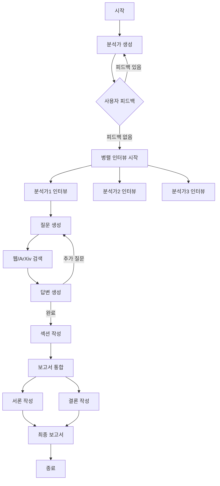

# 🌪️ STORM Research Assistant

> **STORM**(Synthesis of Topic Outline through Retrieval and Multi-perspective question asking) 개념을 활용한 AI 연구 보조 시스템

## 📖 소개

STORM Research Assistant는 복잡한 주제에 대해 심층적인 연구 보고서를 자동으로 생성하는 LangGraph 기반 애플리케이션입니다. 여러 관점을 가진 AI 분석가들이 전문가와 인터뷰를 진행하고, 웹과 학술 자료를 검색하여 종합적인 연구 보고서를 작성합니다.

### 🎯 주요 특징

- **🤖 다중 관점 분석**: 다양한 배경과 전문성을 가진 AI 분석가들이 연구에 참여
- **💬 동적 인터뷰**: 각 분석가가 전문가와 심층 인터뷰 진행
- **🔍 통합 검색**: Tavily(웹 검색)와 ArXiv(학술 논문) 동시 활용
- **📊 병렬 처리**: 여러 인터뷰를 동시에 진행하여 효율성 극대화
- **✏️ 자동 보고서 생성**: 서론, 본문, 결론을 포함한 완성도 높은 보고서 작성
- **🔄 사용자 피드백**: 분석가 생성 단계에서 사용자 개입 가능

## 🏗️ 아키텍처

### 시스템 구조

```
📁 src/storm_research/
├── 📄 __init__.py          # 패키지 초기화
├── 🧠 graph.py            # LangGraph 그래프 정의 (메인 로직)
├── 📊 state.py            # 상태 및 데이터 모델 정의
├── 💬 prompts.py          # 프롬프트 템플릿
├── ⚙️ configuration.py     # 시스템 설정 관리
├── 🔧 tools.py            # 검색 도구 구현
└── 🛠️ utils.py            # 유틸리티 함수
```

### 워크플로우



## 🚀 설치 및 실행

### 1. 환경 설정

```bash
# uv를 사용한 환경 설정
uv venv
source .venv/bin/activate  # Windows: .venv\Scripts\activate

# 의존성 설치
uv pip install -e .
```

### 2. 환경 변수 설정

`.env` 파일을 생성하고 다음 API 키를 설정하세요:

```env
# 필수 API 키
TAVILY_API_KEY=your_tavily_key

# LLM Provider별 API 키 (사용할 provider에 따라 설정)
# OpenAI
OPENAI_API_KEY=your_openai_key

# Anthropic
ANTHROPIC_API_KEY=your_anthropic_key

# Azure OpenAI
AZURE_OPENAI_API_KEY=your_azure_openai_key
AZURE_OPENAI_ENDPOINT=https://your-resource.openai.azure.com/
```

### 3. LangGraph Studio 실행

```bash
# LangGraph Studio 설치 (처음 한 번만)
pip install langgraph-cli

# Studio 실행
langgraph up
```

## 📝 사용 방법

### 기본 사용법

```python
from storm_research import graph
from langchain_core.runnables import RunnableConfig

# 설정
config = RunnableConfig(
    configurable={
        "thread_id": "research-001",
        "model": "azure_openai/gpt-4.1",  # 기본값, 다른 모델도 사용 가능
        "max_analysts": 3,
        "max_interview_turns": 3,
    }
)

# 연구 시작
inputs = {
    "topic": "LangGraph의 장점과 실제 활용 사례",
    "max_analysts": 3
}

# 실행 (첫 번째 단계: 분석가 생성)
result = await graph.ainvoke(inputs, config)

# 사용자 피드백 제공 (선택적)
await graph.aupdate_state(
    config,
    {"human_analyst_feedback": "AI 윤리 전문가를 추가해주세요"},
    as_node="human_feedback"
)

# 연구 완료
final_result = await graph.ainvoke(None, config)
print(final_result["final_report"])
```

### 설정 옵션

| 설정 | 기본값 | 설명 |
|------|--------|------|
| `model` | `azure/gpt-4.1` | 사용할 LLM 모델 (provider/model 형식) |
| `max_analysts` | 3 | 생성할 분석가 수 |
| `max_interview_turns` | 3 | 인터뷰 최대 턴 수 |
| `tavily_max_results` | 3 | Tavily 검색 결과 수 |
| `arxiv_max_docs` | 3 | ArXiv 검색 문서 수 |
| `parallel_interviews` | `True` | 병렬 인터뷰 실행 여부 |

#### 지원 모델
- **Azure OpenAI**: `azure/gpt-4.1`, `azure/gpt-4o` 등
- **OpenAI**: `openai/gpt-4`, `openai/gpt-4-turbo` 등
- **Anthropic**: `anthropic/claude-3-5-sonnet-20240620` 등

## 🧪 테스트

```bash
# 단위 테스트 실행
make test

# 특정 테스트 파일 실행
make test TEST_FILE=tests/unit_tests/test_configuration.py

# 통합 테스트
python -m pytest tests/integration_tests/
```

## 📚 예제

### 기술 리서치
```python
topic = "차세대 AI 아키텍처: Transformer를 넘어서"
```

### 비즈니스 분석
```python
topic = "2024년 한국 스타트업 생태계 분석과 투자 트렌드"
```

### 학술 연구
```python
topic = "양자 컴퓨팅이 암호화 기술에 미치는 영향"
```

## 🤝 기여하기

1. Fork the repository
2. Create your feature branch (`git checkout -b feature/AmazingFeature`)
3. Commit your changes (`git commit -m 'Add some AmazingFeature'`)
4. Push to the branch (`git push origin feature/AmazingFeature`)
5. Open a Pull Request

## 📄 라이선스

이 프로젝트는 MIT 라이선스를 따릅니다. 자세한 내용은 [LICENSE](LICENSE) 파일을 참고하세요.

## 🙏 감사의 말

- Stanford의 STORM 논문에서 영감을 받았습니다
- LangGraph 팀의 훌륭한 프레임워크에 감사드립니다
- Tavily와 ArXiv API를 제공해주신 팀들께 감사드립니다

---

**Made with ❤️ using LangGraph**