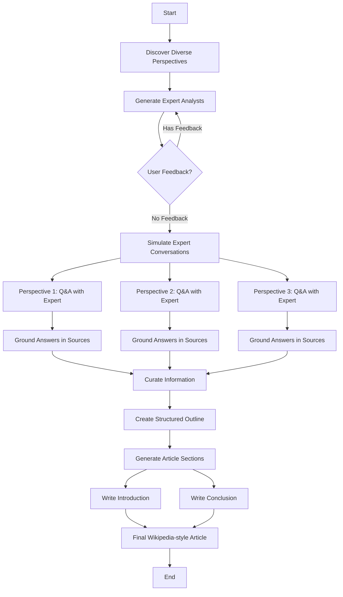

# 🌪️ STORM Research Assistant

<!-- Project badges -->
[](https://opensource.org/licenses/MIT)
[](https://www.python.org/downloads/)
[](https://langchain-ai.github.io/langgraph/)
[](https://github.com/psf/black)

> **STORM** (Synthesis of Topic Outlines through Retrieval and Multi-perspective Question Asking) - A writing system for generating grounded and organized long-form articles from scratch, with comparable breadth and depth to Wikipedia pages

## 📖 Overview

STORM Research Assistant is a LangGraph-based implementation of the STORM methodology from Stanford, designed to write grounded and organized long-form articles from scratch. The system models the pre-writing stage by (1) discovering diverse perspectives for researching the given topic, (2) simulating conversations where writers with different perspectives pose questions to a topic expert grounded on trusted Internet sources, and (3) curating the collected information to create an outline before generating the final article.

### 🎯 Key Features

- **🔍 Pre-writing Stage Modeling**: Comprehensive research and outline preparation before article generation
- **🤖 Diverse Perspective Discovery**: Automatic generation of multiple expert perspectives for comprehensive topic coverage
- **💬 Simulated Expert Conversations**: Multi-perspective question asking with grounded answers from trusted sources
- **📚 Grounded Information**: All content backed by reliable Internet sources (Tavily web search and ArXiv papers)
- **📊 Structured Outline Creation**: Systematic curation of collected information into organized outlines
- **✏️ Long-form Article Generation**: Wikipedia-quality articles with introduction, detailed sections, and conclusion
- **🔄 User Feedback Integration**: Human-in-the-loop capability for refining analyst perspectives
- **⚡ Parallel Processing**: Simultaneous execution of multiple perspective interviews for efficiency
- **🎨 LangGraph Studio Support**: Full integration with LangGraph Studio for visual debugging

## 🏗️ Architecture

### System Structure

```
📁 src/storm_research/
├── 📄 __init__.py          # Package initialization
├── 🧠 graph.py            # LangGraph graph definition (main logic)
├── 📊 state.py            # State and data model definitions
├── 💬 prompts.py          # Prompt templates
├── ⚙️ configuration.py     # System configuration management
├── 🔧 tools.py            # Search tool implementations
└── 🛠️ utils.py            # Utility functions
```

### Workflow



## 🚀 Installation & Setup

### Prerequisites

- Python 3.11 or higher
- [uv](https://github.com/astral-sh/uv) package manager
- API keys for chosen LLM providers

### 1. Clone the Repository

```bash
git clone https://github.com/teddynote-lab/STORM-Research-Assistant.git
cd STORM-Research-Assistant
```

### 2. Environment Setup

```bash
# Create virtual environment using uv
uv venv
source .venv/bin/activate  # On Windows: .venv\Scripts\activate

# Install dependencies
uv pip install -e .

# Install development dependencies
uv pip install -e ".[dev]"
```

### 3. Environment Variables

Create a `.env` file in the root directory and configure the following API keys:

```env
# LangSmith for tracing
LANGSMITH_PROJECT=STORM-Research-Assistant
LANGSMITH_API_KEY=your_langsmith_api_key

# Required API Keys
TAVILY_API_KEY=your_tavily_api_key

# LLM Provider API Keys (choose one or more)
# OpenAI
OPENAI_API_KEY=your_openai_api_key

# Anthropic
ANTHROPIC_API_KEY=your_anthropic_api_key

# Azure OpenAI
AZURE_OPENAI_API_KEY=your_azure_openai_api_key
AZURE_OPENAI_ENDPOINT=https://your-resource.openai.azure.com/
```

### 4. Running LangGraph Studio

```bash
# Install LangGraph CLI (one-time setup)
pip install "langgraph-cli[inmem]"

# Run LangGraph Studio
uv run langgraph dev
```

Access the studio at `http://localhost:2024`

## 📝 Usage

### Basic Usage

```python
from storm_research import graph
from langchain_core.runnables import RunnableConfig

# Configuration
config = RunnableConfig(
    configurable={
        "thread_id": "research-001",
        "model": "openai/gpt-4.1",  # Setup model
        "max_analysts": 3,
        "max_interview_turns": 3,
    }
)

# Start article generation
inputs = {
    "topic": "The Future of Quantum Computing in Cryptography",
    "max_analysts": 3
}

# Execute (First step: Discover perspectives and generate analysts)
result = await graph.ainvoke(inputs, config)

# Provide user feedback (optional) to refine perspectives
await graph.aupdate_state(
    config,
    {"human_analyst_feedback": "Please add a cybersecurity expert perspective"},
    as_node="human_feedback"
)

# Complete the pre-writing stage and generate article
final_result = await graph.ainvoke(None, config)
print(final_result["final_report"])
```

### Configuration Options

| Setting | Default | Description |
|---------|---------|-------------|
| `model` | `azure/gpt-4.1` | LLM model to use (provider/model format) |
| `max_analysts` | 3 | Number of analysts to generate |
| `max_interview_turns` | 3 | Maximum interview turns per analyst |
| `tavily_max_results` | 3 | Number of Tavily search results |
| `arxiv_max_docs` | 3 | Number of ArXiv documents to retrieve |
| `parallel_interviews` | `True` | Whether to run interviews in parallel |

#### Supported Models

- **Azure OpenAI**: `azure/gpt-4.1`, `azure/gpt-4.1-mini`, `azure/gpt-4.1-nano`
- **OpenAI**: `openai/gpt-4.1`, `openai/gpt-4.1-mini`, `openai/gpt-4.1-nano`
- **Anthropic**: `anthropic/claude-opus-4-20250514`, `anthropic/claude-3-7-sonnet-latest`, `anthropic/claude-3-5-haiku-latest`

## 📚 Examples

### Technology Research

```python
topic = "Next-Generation AI Architectures: Beyond Transformers"
```

Generated analysts might include:
- AI Architecture Researcher
- Hardware Optimization Expert
- Industry Applications Specialist

### Business Analysis

```python
topic = "The Impact of AI on Global Supply Chain Management in 2024"
```

Generated analysts might include:
- Supply Chain Expert
- AI Technology Analyst
- Business Strategy Consultant

### Academic Research

```python
topic = "Quantum Error Correction Methods for Scalable Quantum Computing"
```

Generated analysts might include:
- Quantum Physics Researcher
- Error Correction Specialist
- Hardware Implementation Expert


## 📄 License

This project is licensed under the MIT License - see the [LICENSE](LICENSE) file for details.

## 🙏 Acknowledgments

- Based on Stanford's STORM paper: [Assisting in Writing Wikipedia-like Articles From Scratch with Large Language Models](https://arxiv.org/abs/2402.14207)
  - STORM achieves 25% better article organization and 10% broader topic coverage compared to baseline methods
  - The methodology addresses challenges in pre-writing stages including topic research and outline preparation
- Built with [LangGraph](https://langchain-ai.github.io/langgraph/) and [LangChain](https://python.langchain.com/)
- LangChain YouTube Channel: [Building STORM from scratch with LangGraph](https://youtu.be/1uUORSZwTz4?si=4RrM3UIuwwdWKFET)

## 📞 Support

- **Issues**: [GitHub Issues](https://github.com/teddynote-lab/STORM-Research-Assistant/issues)
- **Discussions**: [GitHub Discussions](https://github.com/teddynote-lab/STORM-Research-Assistant/discussions)
- **Documentation**: [Wiki](https://github.com/teddynote-lab/STORM-Research-Assistant/wiki)